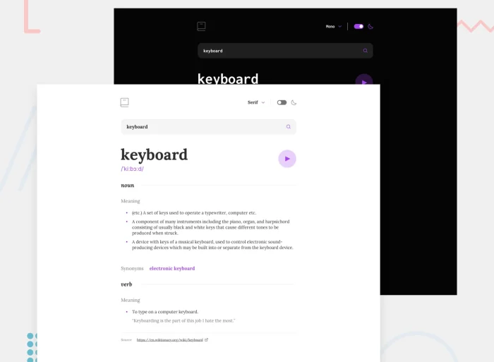

<h1 align='center'>📕Dictionary App with color theme switcher and font selection🚀</h1>

  <h3>
    <a href="https://dictionary-app-main.vercel.app/" color="white">
      Live
    </a>
     | 
    <a href="https://github.com/devllopeadam/dictionary-app-main">
      Solution
    </a>
  </h3>

 

## About The Project

Users should be able to:

1. Search for words using the input field
2. See the Free Dictionary API's response for the searched word
3. See a form validation message when trying to submit a blank form
4. Play the audio file for a word when it's available
5. Switch between serif, sans serif, and monospace fonts
6. Switch between light and dark themes

I do not have access to the Figma sketch so the design is not pixel-perfect.

## Built with

- CSS custom properties
- Flex
- Dictionary API <a href="https://api.dictionaryapi.dev/api/v2/entries/en/Keyboard"> Link to the api </a>
- react JS
- vite
- Framer Motion
- tailwind
